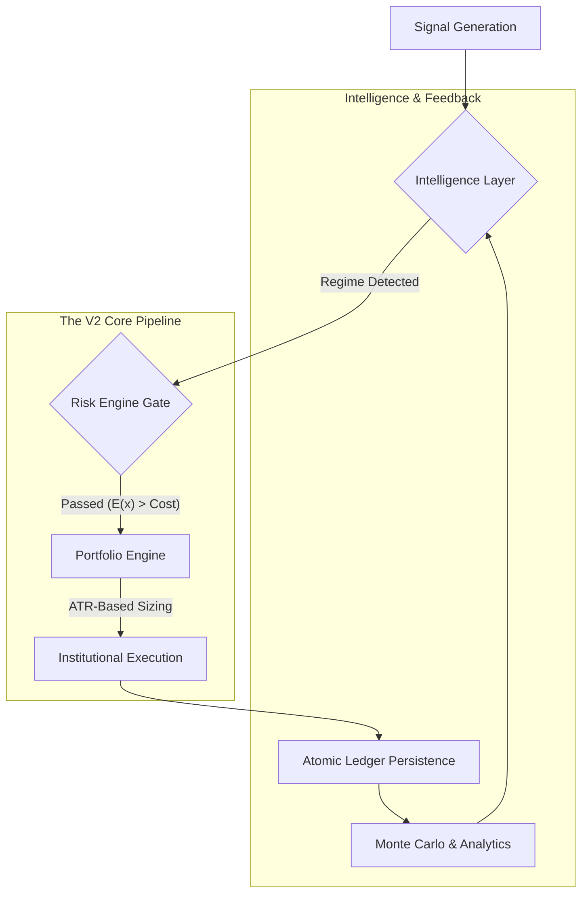

# ProBob V2: Institutional-Grade Systematic Trading Engine 🚀

**Quantitative Systematic Infrastructure for Professional Alpha Generation.**

The V2 Institutional Engine represents a complete architecture shift from retail-grade bots to a robust, modular, and risk-first systematic pipeline. Designed for high-frequency transparency, precision execution, and multi-strategy portfolio management.

---

## 🏗️ High-Performance Architecture

The V2 engine operates on a synchronous modular pipeline where every signal must pass through multiple industrial-grade filters before reaching the execution layer.

---

## 🧠 Core Intelligence Layer

The **Intelligence Layer** is the brain of V2, ensuring strategies are only active during compatible market conditions.

- **Regime Detection**: Real-time classification of markets into `TRENDING`, `RANGING`, or `VOLATILE` using linear regression R² and ATR ratio analysis.
- **Volatility Filtering**: Dynamic leverage adjustment based on historical volatility percentiles.
- **Strategy Ranking**: Probabilistic scoring of active strategies based on their recent Sharpe and Sortino ratios.

---

## 🛡️ Institutional Risk Management

Financial-grade risk controls are at the heart of the V2 engine.

### Pre-Trade Gating (`RiskEngineV2`)
Every order is subjected to a three-tier safety check:
1.  **Signal Quality**: Confidence score must exceed **0.60**.
2.  **Volatility Gate**: System-wide circuit breakers for extreme tail-risk events.
3.  **Cost-Aware Edge**: Estimated trading costs (Spread + Commission + Slippage) are subtracted from the signal's expected move. If the residual edge is negative, the trade is discarded.

### Adaptive Position Sizing (`PortfolioEngineV2`)
We use **ATR-Adjusted Risk Sizing** to ensure uniform volatility exposure across all positions:
- **Risk Per Trade**: Fixed at **1%** of total equity.
- **Stop Distance**: Hard-coded at **2 × ATR** from entry.
- **Dynamic Sizing**: `Units = (Equity * Risk%) / (2 * ATR)`.

---

## 📊 Analytics & Performance

V2 provides deep transparency into the strategy lifecycle:

- **Monte Carlo Simulations**: 500-fold simulations to determine the "Risk of Ruin" and 95% confidence interval for drawdowns.
- **Drawdown Ladders**: Automatic risk reduction as the portfolio approaches user-defined drawdown thresholds.
- **Real-Time Telemetry**: Sub-millisecond logging of every decision point in the pipeline for post-trade analysis.

---

## 🛠️ Technology Stack

| Component | Technology |
| :--- | :--- |
| **Logic** | Python 3.10+ (Systematic Framework) |
| **Data Engine** | Pandas / NumPy (Vectorized Indicators) |
| **API** | Flask (Isolated V2 Blueprints) |
| **Persistence** | MySQL (ACID Compliant) |
| **Real-time** | WebSocket (Socket.IO) |

---

> [!NOTE]
> **V2 Engine Version**: 2.4.0 (Institutional Build)
> **Target Audience**: Financial Traders, Portfolio Managers, Risk Officers.
